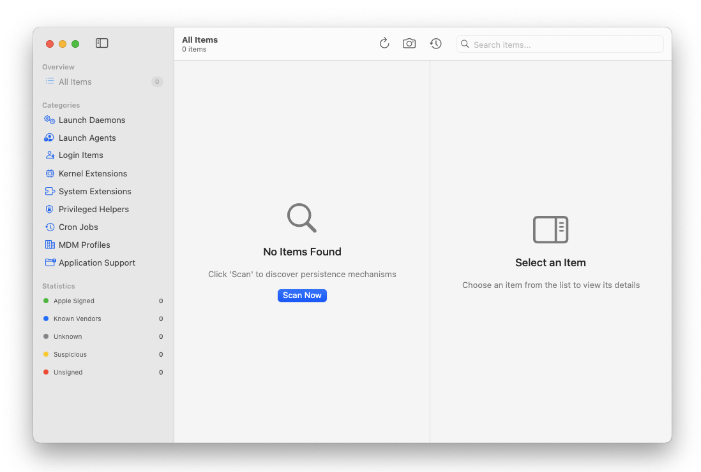
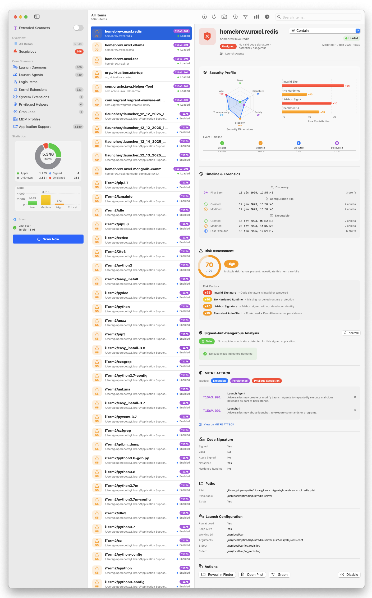
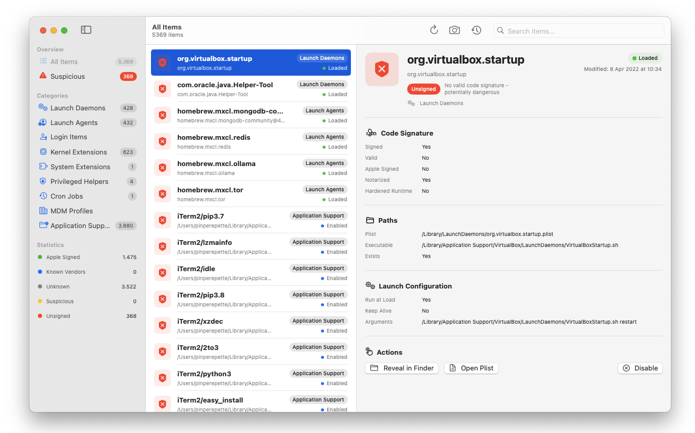
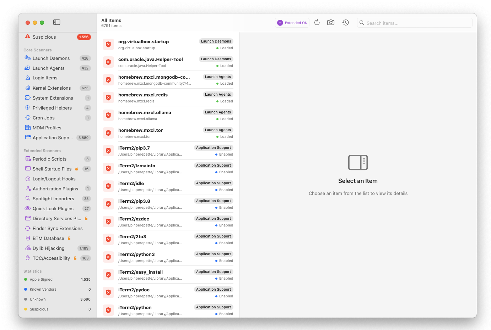
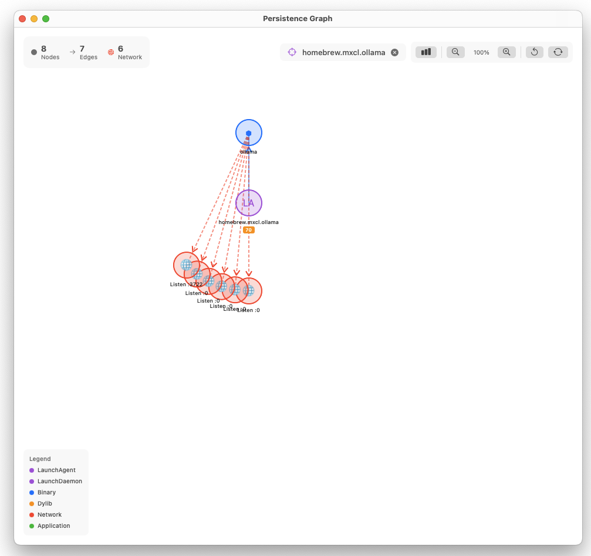
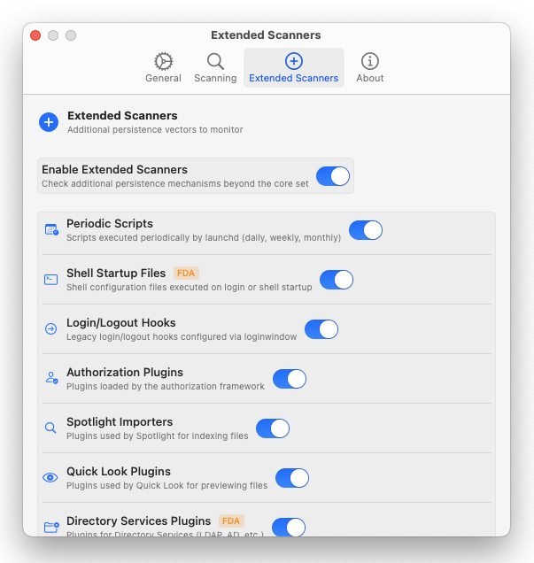
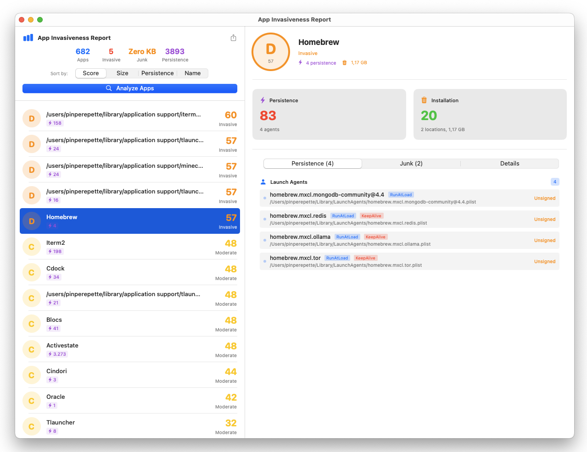
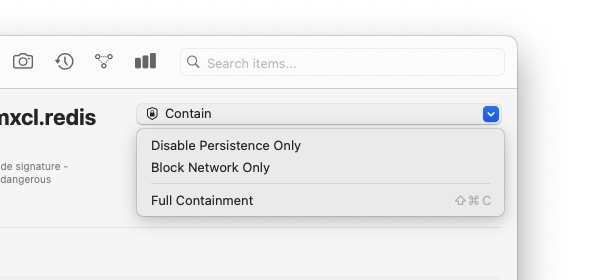

# MacPersistenceChecker

**Show me what stays, explain why it matters, let me decide.**

A native macOS security tool that enumerates everything configured to run automatically on your Mac. Find malware, unwanted software, or understand what's really running on your system.

## Download

**[Download MacPersistenceChecker v1.8 (DMG)](https://github.com/Pinperepette/MacPersistenceChecker/releases/download/v1.8/MacPersistenceChecker.dmg)**

- Requires macOS 13.0 or later
- Universal binary (Apple Silicon & Intel)
- If macOS says the app is damaged: `xattr -cr /Applications/MacPersistenceChecker.app`

## What It Does

MacPersistenceChecker scans every persistence mechanism on macOS, analyzes each item for risk, and gives you the information to decide what should stay and what should go.

---

## Persistence Scanning

### Core Scanners
- **Launch Daemons** - System-wide services (`/Library/LaunchDaemons`, `/System/Library/LaunchDaemons`)
- **Launch Agents** - User-level agents (`~/Library/LaunchAgents`, `/Library/LaunchAgents`)
- **Login Items** - Apps that start at login
- **Kernel Extensions** - Legacy kexts
- **System Extensions** - Modern system extensions (DriverKit, NetworkExtension, EndpointSecurity)
- **Privileged Helper Tools** - XPC services with elevated privileges
- **Cron Jobs** - Scheduled tasks
- **Configuration Profiles** - MDM and configuration profiles
- **Application Support** - Background apps and helpers

### Extended Scanners (optional)
- **Periodic Scripts** - Daily, weekly, monthly scripts in `/etc/periodic/`
- **Shell Startup Files** - `.zshrc`, `.bashrc`, `/etc/profile` with suspicious pattern detection
- **Login/Logout Hooks** - Legacy login hooks via `com.apple.loginwindow`
- **Authorization Plugins** - Security Agent plugins in `/Library/Security/SecurityAgentPlugins`
- **Spotlight Importers** - Custom metadata importers
- **Quick Look Plugins** - Preview generators that could be abused
- **Directory Services Plugins** - Authentication plugins
- **Finder Sync Extensions** - Finder extensions via pluginkit
- **BTM Database** - Background Task Management entries (macOS 13+)
- **Dylib Hijacking** - Detection of `DYLD_INSERT_LIBRARIES` and suspicious dylib injection
- **TCC/Accessibility** - Apps with Accessibility permissions in TCC database

---

## Risk Assessment

Every persistence item gets a **Risk Score (0-100)** based on multiple factors:

- Invalid or missing code signatures
- Missing hardened runtime protection
- Ad-hoc signed binaries
- Suspicious file locations
- Persistent auto-start configurations (RunAtLoad, KeepAlive)
- Known malware patterns

**Severity Levels:** Low, Medium, High, Critical - items sorted by risk for quick threat identification.

### Launch Frequency Anomaly Detection
- **Micro-Restart** - StartInterval < 60 seconds (possible watchdog abuse)
- **Aggressive Watchdog** - KeepAlive + low StartInterval combination
- **No Throttle Limit** - KeepAlive without ThrottleInterval (crash-restart loop risk)

### Signed-but-Dangerous Detection
- **Dangerous Entitlements** - Detection of risky entitlements (`com.apple.security.cs.disable-library-validation`, etc.)
- **Apple Impersonation** - Non-Apple software trying to appear as Apple
- **Hidden Locations** - Signed apps in suspicious directories
- **Notarization Gaps** - Recent apps lacking notarization
- **Developer Certificate Analysis** - Team ID validation against known vendors

### Trust Levels
- 🟢 **Apple** - Signed by Apple
- 🔵 **Known Vendor** - Verified third-party software
- 🟡 **Signed** - Valid signature but not notarized
- ⚪ **Unknown** - No executable to verify
- 🟠 **Suspicious** - Expired certificate or suspicious path
- 🔴 **Unsigned** - No valid signature

---

## Timeline & Forensics

Comprehensive forensic timeline for each persistence item:

**Discovery**
- First Seen - When the item was first discovered

**Configuration File (Plist)**
- Created - File creation timestamp
- Modified - Last modification timestamp

**Executable (Binary)**
- Created - Binary creation timestamp
- Modified - Last modification timestamp
- Last Executed - Last access/execution time

### Timestamp Anomaly Detection
- **Timestomping** - Creation date after modification date (anti-forensics technique)
- **File Replacement** - File created after initial discovery
- **Binary Swap** - Recently modified binary with old plist (possible trojan)
- **Recent Execution** - Binary accessed recently but not currently loaded

---

## MITRE ATT&CK Integration

Every persistence mechanism mapped to MITRE ATT&CK framework:

- **Tactics**: Persistence, Privilege Escalation, Defense Evasion, Execution
- **Techniques**: T1543.001, T1543.004, T1547.001, T1547.015, and more
- Direct links to MITRE ATT&CK documentation

---

## App Invasiveness Report

Comprehensive analysis of installed apps to evaluate their "invasiveness" level:

### Dual Scoring System

**Persistence Score (0-100)** - Evaluates persistence mechanisms:
- Trigger types (RunAtLoad, KeepAlive)
- Privilege levels (LaunchDaemons, Kernel Extensions, Privileged Helpers)
- Resilience (auto-restart, updaters)
- Redundancy (multiple items from same vendor)
- Trust level (unsigned/suspicious penalties)

**Installation Score (0-100)** - Evaluates "junk" footprint:
- File spread across Library folders
- Total disk usage
- Orphan files (persistence without matching app)
- Cache bloat
- System-wide installations

### Grade System
Apps rated **A through F** based on combined score with detailed breakdown of all scoring factors.

---

## Visualization

### Statistics Dashboard
- **Risk Distribution Histogram** - Items by risk bands (Low, Medium, High, Critical)
- **Trust Level Donut Chart** - Distribution across trust levels
- **Category Breakdown Chart** - Items per persistence category
- **Timeline Visualization** - Item lifecycle events (Created, Modified, Executed, Discovered)

### Interactive Graph
- **Full System Graph** - Overview of all persistence items and relationships
- **Focused Item Graph** - Radial graph for individual item analysis
- **Analysis Modes**: Basic (trust/categories) or Full (includes dylib dependencies, network connections)
- **Interactive Canvas** - Zoom, pan, explore relationships
- **Color-coded by trust level** - Quick visual threat assessment

### Security Profile Radar
Comprehensive radar chart showing Trust, Signature, Safety, Stability, Transparency, and Age dimensions at a glance.

---

## Real-time Monitoring

### Menu Bar Integration
- Monitoring status indicator
- Quick controls (Start/Stop monitoring, trigger scan)
- Badge count for unacknowledged changes

### Change Detection
- FSEvents-based monitoring with intelligent noise suppression
- Notifications for new, modified, or removed persistence items
- Baseline comparison

---

## Snapshots & Comparison

- Create snapshots of your system state
- Compare snapshots to detect changes over time
- Track new, removed, or modified persistence items
- Identify when suspicious items were added

---

## Actions

- **Reveal in Finder** - Quickly locate files
- **Open Plist** - View configuration files
- **View Graph** - Per-item graph visualization
- **Disable/Enable** - Safely disable items (with admin privileges for system items)

---

## Screenshots

















---

## Building from Source

```bash
git clone https://github.com/Pinperepette/MacPersistenceChecker.git
cd MacPersistenceChecker
./build.sh
```

Copy `MacPersistenceChecker.app` to `/Applications/`.

### Requirements
- macOS 13.0+
- Xcode 15+ or Swift 5.9+

### Dependencies
- [GRDB.swift](https://github.com/groue/GRDB.swift) - SQLite database

---

## Permissions

Requires **Full Disk Access** to scan:
- `/Library/LaunchDaemons`
- System configuration files
- TCC database
- Shell startup files

Without Full Disk Access, some items may not be visible.

---

## License

MIT License - See [LICENSE](LICENSE) for details.

## Author

**pinperepette** - 2025

---

*Inspired by [Autoruns](https://docs.microsoft.com/en-us/sysinternals/downloads/autoruns) for Windows by Mark Russinovich*
