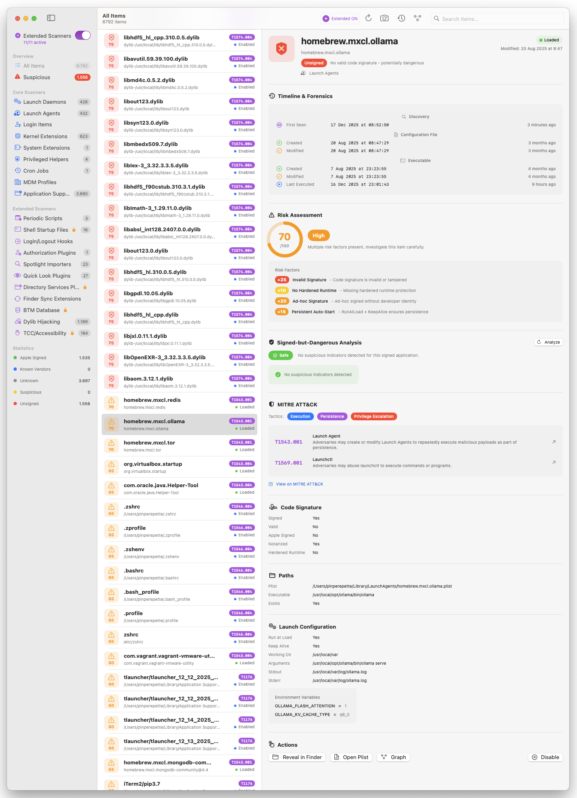

# MacPersistenceChecker

**Autoruns for macOS** - Enumerate, analyze and control every persistence mechanism on your system.

A native macOS security tool that shows you everything configured to run automatically on your Mac. Find malware, unwanted software, or just understand what's running on your system.

## Download

**[Download MacPersistenceChecker v1.3 (DMG)](https://github.com/Pinperepette/MacPersistenceChecker/releases/download/v1.3/MacPersistenceChecker.dmg)**

- Requires macOS 13.0 or later
- Universal binary (Apple Silicon & Intel)
- If the application appears corrupted or macOS displays a message stating the app is damaged, open Terminal and run the following command:

  xattr -cr /path/to/Application.app

  Replace /path/to/Application.app with the actual path to the application. This command removes extended attributes, including the quarantine flag, that may prevent the app from launching.

## Features

### Core Scanners - Complete Persistence Enumeration
- **Launch Daemons** - System-wide services (`/Library/LaunchDaemons`, `/System/Library/LaunchDaemons`)
- **Launch Agents** - User-level agents (`~/Library/LaunchAgents`, `/Library/LaunchAgents`)
- **Login Items** - Apps that start at login
- **Kernel Extensions** - Legacy kexts
- **System Extensions** - Modern system extensions (DriverKit, NetworkExtension, EndpointSecurity)
- **Privileged Helper Tools** - XPC services with elevated privileges
- **Cron Jobs** - Scheduled tasks
- **Configuration Profiles** - MDM and configuration profiles
- **Application Support** - Background apps and helpers

### Extended Scanners
Optional advanced persistence detection that can be enabled/disabled:

- **Periodic Scripts** - Daily, weekly, monthly scripts in `/etc/periodic/`
- **Shell Startup Files** - `.zshrc`, `.bashrc`, `/etc/profile` and other shell configs with suspicious pattern detection
- **Login/Logout Hooks** - Legacy login hooks via `com.apple.loginwindow`
- **Authorization Plugins** - Security Agent plugins in `/Library/Security/SecurityAgentPlugins`
- **Spotlight Importers** - Custom metadata importers
- **Quick Look Plugins** - Preview generators that could be abused
- **Directory Services Plugins** - Authentication plugins
- **Finder Sync Extensions** - Finder extensions via pluginkit
- **BTM Database** - Background Task Management entries (macOS 13+)
- **Dylib Hijacking** - Detection of `DYLD_INSERT_LIBRARIES` and suspicious dylib injection
- **TCC/Accessibility** - Apps with Accessibility permissions in TCC database

### Risk Assessment (New in v1.3)
Automatic security risk scoring for every persistence item:

- **Risk Score (0-100)** - Quantified risk level based on multiple factors
- **Risk Factors Analysis**:
  - Invalid or missing code signatures
  - Missing hardened runtime protection
  - Ad-hoc signed binaries
  - Suspicious file locations
  - Persistent auto-start configurations
  - Known malware patterns
- **Severity Levels**: Low, Medium, High, Critical
- Items are sorted by risk score for quick threat identification

### Signed-but-Dangerous Detection (New in v1.3)
Advanced analysis to detect legitimately signed but potentially malicious software:

- **Dangerous Entitlements** - Detection of risky entitlements (com.apple.security.cs.disable-library-validation, etc.)
- **Apple Impersonation** - Identifies non-Apple software trying to appear as Apple
- **Hidden Locations** - Flags signed apps in suspicious directories
- **Notarization Gaps** - Recent apps lacking notarization
- **Developer Certificate Analysis** - Validates Team IDs against known vendors

### Timeline & Forensics (New in v1.3)
Comprehensive forensic timeline for each persistence item:

- **Discovery**
  - First Seen - When the item was first discovered by the app
- **Configuration File (Plist)**
  - Created - File creation timestamp
  - Modified - Last modification timestamp
- **Executable (Binary)**
  - Created - Binary creation timestamp
  - Modified - Last modification timestamp
  - Last Executed - Last access/execution time
- **Network Activity**
  - First Connection - First observed network activity
  - Last Connection - Most recent network activity

#### Timestamp Anomaly Detection
Automatic detection of suspicious timestamp patterns:

- **Timestomping** - Creation date after modification date (anti-forensics technique)
- **File Replacement** - File created after initial discovery
- **Binary Swap** - Recently modified binary with old plist (possible trojan)
- **Recent Execution** - Binary accessed recently but not currently loaded

### MITRE ATT&CK Integration
Every persistence mechanism is mapped to MITRE ATT&CK framework:

- **Tactics**: Persistence, Privilege Escalation, Defense Evasion, Execution
- **Techniques**: T1543.001, T1543.004, T1547.001, T1547.015, and more
- Direct links to MITRE ATT&CK documentation

### Interactive Graph Visualization (New in v1.3)
Visual representation of persistence relationships:

- **Full System Graph** - Overview of all persistence items
- **Focused Item Graph** - Radial graph for individual item analysis
- **Analysis Modes**:
  - Basic - Trust relationships and categories
  - Full - Includes dylib dependencies and network connections
- **Interactive Canvas** - Zoom, pan, and explore relationships
- **Color-coded by trust level** - Quick visual threat assessment

### Trust Verification
- **Code Signature Verification** - Validates signatures using Security.framework
- **Notarization Check** - Verifies Apple notarization status
- **Known Vendor Database** - Identifies trusted software vendors
- **Color-coded Trust Levels**:
  - 🟢 **Apple** - Signed by Apple
  - 🔵 **Known Vendor** - Verified third-party software
  - 🟡 **Signed** - Valid signature but not notarized
  - ⚪ **Unknown** - No executable to verify
  - 🟠 **Suspicious** - Expired certificate or suspicious path
  - 🔴 **Unsigned** - No valid signature

### Timeline & Snapshots
- Create snapshots of your system state
- Compare snapshots to detect changes over time
- Track new, removed, or modified persistence items
- Identify when suspicious items were added

### Control Actions
- **Reveal in Finder** - Quickly locate files
- **Open Plist** - View configuration files
- **View Graph** - Per-item graph visualization
- **Disable/Enable** - Safely disable items (with admin privileges for system items)

## Screenshots





## Building from Source

### Requirements
- macOS 13.0+
- Xcode 15+ or Swift 5.9+

### Build

```bash
git clone https://github.com/Pinperepette/MacPersistenceChecker.git
cd MacPersistenceChecker
swift build -c release
```

The executable will be in `.build/release/MacPersistenceChecker`.

### Dependencies
- [GRDB.swift](https://github.com/groue/GRDB.swift) - SQLite database

## Usage

1. Launch the app
2. Grant Full Disk Access when prompted (required to scan all persistence locations)
3. Click "Scan" to enumerate all persistence mechanisms
4. Enable "Extended Scanners" in toolbar or sidebar for additional checks
5. Review items - high-risk items are sorted first
6. Click on any item to see detailed forensic timeline and risk assessment
7. Use the Graph button to visualize relationships
8. Use "Snapshot" to save the current state for future comparison

## Permissions

MacPersistenceChecker requires **Full Disk Access** to read:
- `/Library/LaunchDaemons`
- System configuration files
- TCC database
- Shell startup files

Without Full Disk Access, some items may not be visible.

## Changelog

### v1.3
- **Risk Assessment System** - Automatic risk scoring (0-100) for every item with detailed risk factor breakdown
- **Signed-but-Dangerous Detection** - Advanced analysis for signed but potentially malicious software
- **Timeline & Forensics** - Complete forensic timeline with file creation, modification, and execution timestamps
- **Timestamp Anomaly Detection** - Automatic detection of timestomping, file replacement, and binary swap attacks
- **MITRE ATT&CK Mapping** - Every persistence mechanism linked to ATT&CK tactics and techniques
- **Interactive Graph Visualization** - Full system graph and per-item focused graphs
- **Improved Search** - Faster, more responsive search functionality
- **Enhanced UI** - Items sorted by risk score, improved detail view layout

### v1.2
- Added 11 new Extended Scanners for advanced persistence detection
- Shell startup file analysis with suspicious pattern detection
- Dylib hijacking detection
- TCC/Accessibility permission monitoring
- BTM database scanning (macOS 13+)
- Enable/disable individual scanners in Settings
- Improved disable functionality for all item types

### v1.0
- Initial release
- Core persistence enumeration
- Trust verification
- Snapshot comparison

## License

MIT License - See [LICENSE](LICENSE) for details.

## Author

**pinperepette** - 2025

---

*Inspired by [Autoruns](https://docs.microsoft.com/en-us/sysinternals/downloads/autoruns) for Windows by Mark Russinovich*
